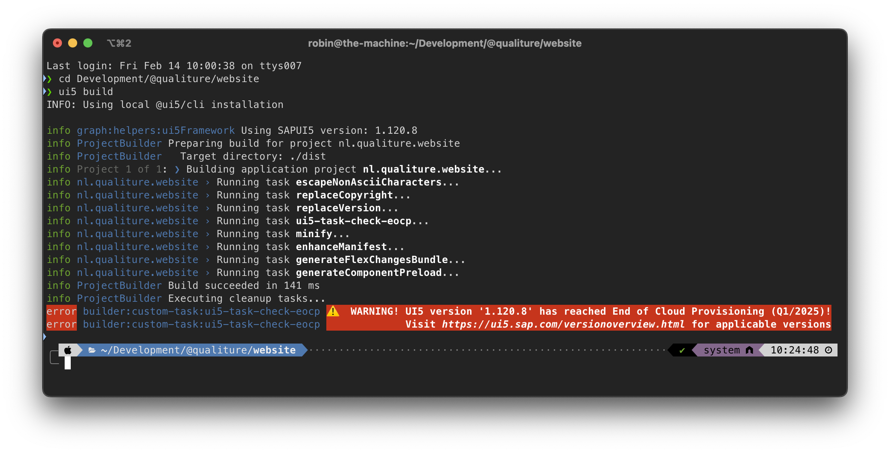

# UI5 task for checking the End of Cloud Provisioning date of the used UI5 version 

Task for [ui5-builder](https://github.com/SAP/ui5-builder), checking expiring End of Cloud Provisioning date

## Prerequisites

- Requires at least [`@ui5/cli@3.0.0`](https://sap.github.io/ui5-tooling/v3/pages/CLI/) (to support [`specVersion: "3.0"`](https://sap.github.io/ui5-tooling/pages/Configuration/#specification-version-30))

## Install

```bash
npm install ui5-task-check-eocp --save-dev
```

## Usage

1. Define the dependency in `$yourapp/package.json`:

```json
"devDependencies": {
    // ...
    "ui5-task-check-eocp": "*"
    // ...
}
```

2. configure it in `$yourapp/ui5.yaml`:

```yaml
builder:
  customTasks:
  - name: ui5-task-check-eocp
    afterTask: replaceVersion
    configuration:
      failOnEocp: true
```

## Configuration options (in `$yourapp/ui5.yaml`)

- failOnEocp: `boolean` (default: `false`) When set to `true`, it will fail the build. Also, due to the async nature of the check, make this task the first and all others dependent in this task using the `afterTask` setting.

## How it works

The task checks the application's UI5 version (as specified in the `ui5.yaml` file), and matches it with the UI5 versions available (these are retrieved from http://ui5.sap.com). If the current date is within (or after) the End of Cloud Provisioning quarter, it prints a warning during the `ui5 build` execution like this:



**NB: In case of expired provisioning date, the task does not halt the `ui5 build` process from executing. It is the developer's responsibility to proceed and update the UI5 version at will.**


## Licence

Standard MIT license

If you find this extension useful, buy Qualiture (Robin van het Hof) a beer when you see him 🙂
